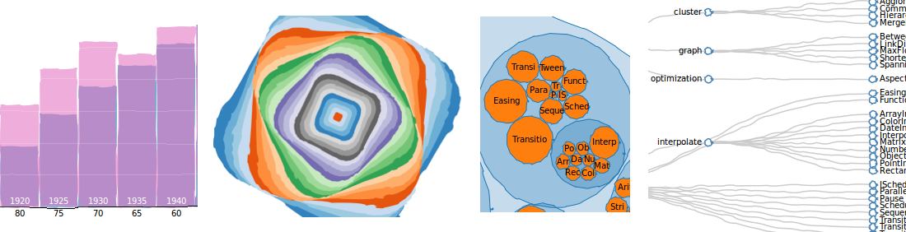
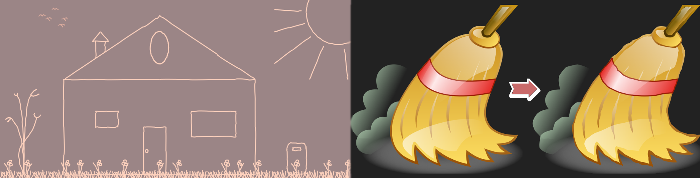

comic.js
=======

Javascript library that acts as plugin for [Raphael.js](http://raphaeljs.com/), [D3.js](http://d3js.org/), [SVG.js](http://svgjs.com/) or as lib for the [HTML5 Canvas](http://www.w3schools.com/html/html5_canvas.asp), providing functions for cartoon style drawing.

Beta4: some bugs fixed: 'cRect' draws correct, closed shapes, 'magic' doesn't overwrite global 'svg' and can be called more reliably on 'svg' via `svg.magic()`.

Beta3: many bugs fixed, most importantly closed shapes now always remain closed allowing for correct filling!

Beta2: "magic" function cartoonizes SVG images & drawings. Drawing methods return path objects native to the library you decide to use - this allows for e.g. translation and rotation of the comic shapes.




Examples
--------
Cartoonized D3 examples:
[D3 Cartoonized!](http://bl.ocks.org/balint42)

[Raphael.js](http://www.morvai.de/comicjs/index1.html),
[D3.js](http://www.morvai.de/comicjs/index2.html),
[SVG.js](http://www.morvai.de/comicjs/index3.html),
[Canvas](http://www.morvai.de/comicjs/index4.html),

using "magic": 
[on images](http://www.morvai.de/comicjs/magic1.html),
[on drawings](http://www.morvai.de/comicjs/magic2.html)

Usage
-----
Simply include `comic.min.js` _after_ including one of the supported libraries ([Raphael.js](http://raphaeljs.com/), [D3.js](http://d3js.org/), [SVG.js](http://svgjs.com/)) - or none of them if you are using a [HTML5 Canvas](http://www.w3schools.com/html/html5_canvas.asp) or just the `magic` function for images. Then it can be used as follows, assuming that you have a container `div` or `canvas` with id `paper` where needed:

The "magic" function universally goes:
```
// for images
COMIC.magic([ document.getElementById('img1'),
              document.getElementById('img2') ]);
// for drawings
shapes.magic(); // where "shapes" is a drawing group created on "paper"
                // via the lib of your choice (see examples below)
```

Drawing depending on the lib you use:
```
// Raphael.js
paper = Raphael("paper", width, height);
stuff = paper.set();
```
or
```
// D3.js
paper = d3.select("#paper").append('svg');
stuff = paper.append("g");
```
or
```
// SVG.js
paper = SVG('paper').size(width, height);
stuff = paper.group();
```
or
```
// canvas
paper = document.getElementById("paper");
ctx = paper.getContext("2d");
// IMPORTANT: here we bind comic.js to the canvas context
COMIC.ctx(ctx);
```
and then for the SVG libs (SVG.js, D3.js, Raphael.js):
```
// these are the default values if you do not call "init"
COMIC.init({
    ff: 8,      // fuzz factor for line drawing: bigger -> fuzzier
    ffc: 0.4,   // fuzz factor for curve drawing: bigger -> fuzzier
    fsteps: 50, // number of pixels per step: smaller -> fuzzier
    msteps: 4,  // min number of steps: bigger -> fuzzier
});
// lets draw!
stuff.cLine(x1, y1, x2, y2);         // LINE from starting point to end point
stuff.cTrian(x1, y1, x2, y2, x3, y3); // TRIANGLE over three corner points
stuff.cRect(x1, y1, width, height, rh, rv); // RECTANGLE at upper left point (x1, y1) with
                                            // width & height and with rounded (elliptic) corners
                                            // with horizontal radius rh & vertical radius rv
stuff.cBezier2(x1, y1, cx, cy, x2, y2); // BEZIER (quadratic) curve with start point (x1, y1),
                                        // control point (cx, cy) and end point (x2, y2)
stuff.cBezier3(x1, y1, cx1, cy1, cx2, cy2, x2, y2); // BEZIER (cubic) curve with start point
                                                    // (x1, y1), control points (cx1, cy1) & (cx2, cy2)
                                                    // and end point (x2, y2)
stuff.cCircle(x1, y1, r, start, end); // CIRCLE at center point (x1, y1) with radius r and drawn
                                      // starting from 0 < start < 2*PI to 0 < end < 2*PI
stuff.cEllipse(x1, y1, rh, rv, rot, start, end); // ELLIPSE at center point with horizontal radius
                                                 // rh & vertical radius rv, rotation 0 < rot < 2*PI
                                                 // and drawn from 0 < start < 2*PI to 0 < end < 2*PI
// changing the look
stuff.attr({
    "stroke":"#E0AE9F",
    "stroke-width": 2,
    "fill": "none"
});
```
Beyond this all depends on your choice of library - e.g. translation:
```
// Raphael.js
stuff.transform("t100,100r45");
// D3.js
stuff.attr({ "transform":"translate(30) rotate(45)" });
// SVG.js
stuff.transform({ x:100, y:100, rotation:45 });
```
For the HTML5 Canvas almost everything works identically.
However to change the looks:
```
// changing the look
ctx.strokeStyle = "#FDD1BD";
ctx.lineWidth = 3;
ctx.globalCompositeOperation = 'destination-over';
```
While the drawing works exactly as above:
```
// lets draw!
stuff.cLine(x1, y1, x2, y2)
     .cTrian(x1, y1, x2, y2, x3, y3)
     .cRect(x1, y1, width, height);
```

All further things should work the default way of your chosen library. I have done little experiments though and errors are probable - please let me know if you encounter any. 

Credits
-------
Inspired by and based on [Jonas Wagner's work](http://29a.ch/2010/2/10/hand-drawn-lines-algorithm-javascript-canvas-html5)
which is based on this [paper](http://iwi.eldoc.ub.rug.nl/FILES/root/2008/ProcCAGVIMeraj/2008ProcCAGVIMeraj.pdf)
